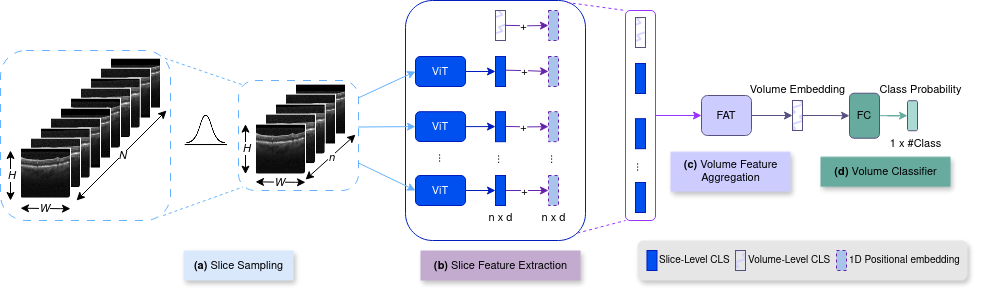

# VLFATRollOut
This repository contains the source code of the following paper:
**[VLFATRollout: Fully Transformer-based Classifier for Retinal OCT Volumes](https://www.sciencedirect.com/science/article/pii/S0895611124001290)**, Marzieh Oghbaie, Teresa Araujo, Ursula Schmidt-Erfurth, Hrvoje Bogunovic

The proposed network deploys Transformers for volume classification that is able to handle variable volume resolutions both at development and inference time.  
## Proposed Approach for 3D volume Classification


The main models are available at `model_zoo/feature_extrc/models.py`.


## Installation
Please check [INSTALL.md](INSTALL.md) for installation instructions. 

## Training
For OLIVES dataset, the list of samples should be provided in a `.csv` file under `dataset` to `annotation_path_test` field. The file should at least includes `sample_path`,`FileSetId`,`label`,`label_int`,`n_frames`.
On Duke dataset, however, give the directory of the samples arranged like the following to the dataloader is sufficient: `subset/class`.
```shell
python main/Smain.py --config_path config/YML_files/VLFATRollout.yaml
```
- Baseline experiments:
  - To run the baseline experiments, please refer to the following repo: https://github.com/marziehoghbaie/VLFAT
## Evaluation
- Simple Test with confusion matrix: set the `train: false` and `allow_size_mismatch: false` under `train_config` in the corresponding config file.
 
```shell
python main/Smain.py --config_path config/YML_files/FATRollOut.yaml
```
## Acknowledgement
This repository is built using the [timm](https://github.com/rwightman/pytorch-image-models) library, [Pytorch](https://pytorch.org) and [Meta Research](https://github.com/facebookresearch) repositories.

## License
This project is released under the MIT license. Please see the [LICENSE](LICENSE) file for more information.

## Citation

